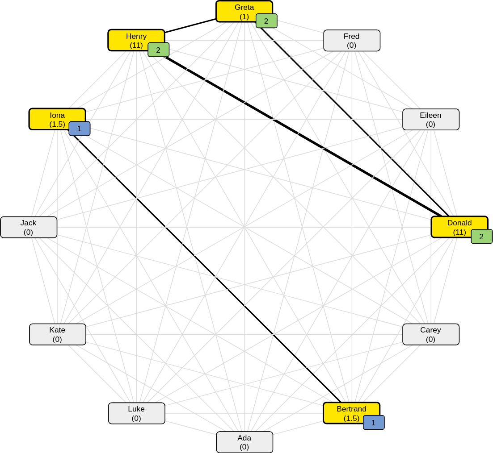

# js-collabgraph

Minimal JavaScript tool to visualise collaborations among participants in a circular graph.

Each participant is represented by a node (yellow), displaying her/his name and the total duration of collaboration sessions. For those participants that have already collaborated, the number of collaborators is represented in an additional rectangle at the lower right corner of the node (blue in case of a single collaborator, green in case of multiple collaborators).



## Example

It's easy to visualise your collaborations:

**Overview:**
1. Copy the contents of the `app` directory to a suitable place.
2. Edit the contents of `participants.js`  and `collaborations.js`.
3. Open `index.html` with a browser.

**Details:**

The contents of `participants.js` are basically as follows.

```
const ada = new Participant("Ada");
const bertrand = new Participant("Bertrand");
// further participants
```

In each line, we define a participant by providing a name (e.g. `Ada`) that is used in each node of the graph and store it in a constant (e.g. `ada`) or variable. The latter can then be used in the collaboration protocol, defined in `collaborations.js`.

```
session("2023-03-05", 1.5, [bertrand, iona]);
session("2023-03-05", 1.0, [donald, greta, henry]);
```

Each "collaboration session" is assigned a date, an approximate duration and an array of participants. So far, the duration of all relevant sessions are summed up (rounded) and displayed in the nodes of the collaboration graph.

## Development notes

In this first prototype,
- the dates are ignored (i.e. all sessions are relevant);
- highlighting of nodes and edges depends on collaborations in an either/or fashion only and
- the style of the collaborator numbers varies between none/one/multiple collaborators only.

This tool uses [mxgraph](https://jgraph.github.io/mxgraph/). See the project's page for more details on browser requirements.
